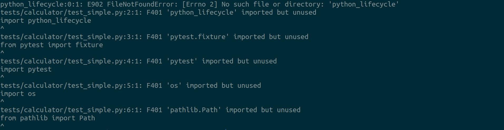

======
Flake8
======

Flake8 is a Python library that wraps **PyFlakes**, **pycodestyle** and **Ned
Batchelder’s McCabe script**. It is a great toolkit for checking your codebase against
coding style (PEP8), programming errors (like “library imported but unused” and
“Undefined name”) and to check cyclomatic complexity.

If you are not familiar with the term **cyclomatic complexity**, it is a software metric
created by Thomas J. McCabe to measure the number of independent paths through the
source code. Generally speaking, the higher number of **ifs** inside a function, the
higher number of paths it will have, thus a higher **cyclomatic complexity**. Of course,
there are other control flow operations that impact the calculus of the cyclomatic
complexity. It is also referred to as McCabe complexity.

For further details visit https://flake8.pycqa.org/en/latest/index.html

Installation
------------

.. code-block:: console

    $ poetry add flake8 --dev

Configuration
-------------

Create a ``setup.cfg`` file and add the following:

.. code-block:: cfg

    [flake8]
    max-line-length = 88
    max-complexity = 10
    show-source = true
    per-file-ignores =
        # imported but unused
        __init__.py: F401

Usage
-----

.. code-block:: console

    $ flake8 python_lifecycle tests

To move on to the next step commit or stash your changes then checkout to the branch
``init/format/black``

.. code-block:: console

    $ git stash
    $ git checkout init/format/black

Uninstall
---------

.. code-block:: console

    $ poetry remove flake8 --dev
