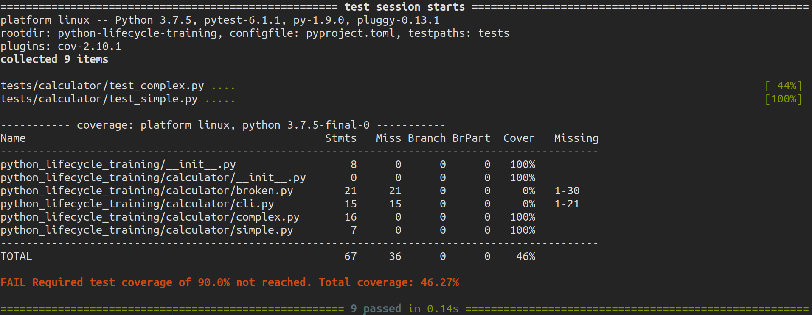
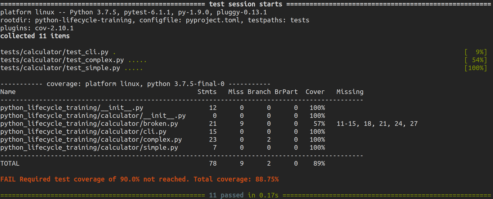

===================
Testing: pytest-cov
===================

**pytest-cov** is a pytest plugin that produces coverage reports. Compared to just using
``coverage run`` this plugin has some extra features:

* Subprocess support: you can fork or run stuff in a subprocess and will get covered
  without any fuss.
* Consistent pytest behavior. If you run ``coverage run -m pytest`` you will have
  slightly different ``sys.path`` (CWD will be in it, unlike when running ``pytest``).

All features offered by the coverage package should work, either through pytest-cov’s
command-line options or through coverage’s config file.

Installation
------------

.. code-block:: console

    $ poetry add pytest-cov --dev

Usage
-----

.. code-block:: console

    $ pytest --cov

.. image:: docs/_static/pytest-cov/img/pytest-cov.png
   :alt: Pytest coverage output

Terminal report with missing line numbers:

.. code-block:: console

    $ pytest --cov --cov-report=term-missing

.. image:: docs/_static/pytest-cov/img/term-missing.png
   :alt: Pytest coverage output with missing line numbers

Terminal report with skip covered:

.. code-block:: console

    $ pytest --cov --cov-report=term-missing:skip-covered

.. image:: docs/_static/pytest-cov/img/skip-covered.png
   :alt: Pytest coverage output with skip covered

HTML report:

.. code-block:: console

    $ pytest --cov --cov-report=html
    $ chromium htmlcov/index.html

.. image:: docs/_static/pytest-cov/img/html.png
   :alt: HTML report of pytest coverage

.. note:: You can replace pytest and coverage with pytest-cov in your dev-dependencies

Configuration
-------------

Update the ``pytest`` configuration in ``pyproject.toml`` so that ``pytest-cov`` always
runs when you run ``pytest``.

.. code-block:: cfg

    [tool.pytest.ini_options]
    testpaths = "tests"
    addopts = "--cov --cov-report=term-missing"

Tests
-----

We can see that we failed to acquire the required test coverage. Let us write some more
tests. Create ``test_complex.py`` to start writing tests for the complex calculator.

.. code-block:: python

    import pytest

    from python_lifecycle_training.calculator import complex

    class TestCalculator:
        @staticmethod
        def test_add():
            assert complex.Calculator.add(1, 2) == 3

        @staticmethod
        def test_sub():
            assert complex.Calculator.sub(2, 1) == 1

        @staticmethod
        def test_mul():
            assert complex.Calculator.mul(1, 2) == 2

        @staticmethod
        def test_div():
            assert complex.Calculator.div(2, 1) == pytest.approx(2)

Run tests

.. code-block:: console

    $ pytest

Exceptions
~~~~~~~~~~

To write assertions about raised exceptions, you need to use ``pytest.raises`` as a
context manager.

.. code-block:: python

    @staticmethod
    def test_div_by_zero():
        with pytest.raises(ZeroDivisionError) as excinfo:
            complex.Calculator.div(2, 0)
        assert str(excinfo.value) == "division by zero"

Run tests

.. code-block:: console

    $ pytest

Warnings
~~~~~~~~

Exception handling is quite important as we don't want them showing up in our production
server. Let's write a warning when we encounter this problem.

.. code-block:: python

    import warnings

    import fire
    from loguru import logger

    import python_lifecycle_training

    class Calculator:
        ...

        @staticmethod
        def div(a, b):
            logger.info(f"Dividing {a} by {b}")
            if python_lifecycle_training.ENV == "production":
                try:
                    return a / b
                except ZeroDivisionError as e:
                    warnings.warn(str(e), RuntimeWarning)
            else:
                return a / b

You can check that code raises a particular warning using ``pytest.warns``, which works
similar to ``raises``.

.. code-block:: python

    import python_lifecycle_training

    def test_div_by_zero():
        python_lifecycle_training.ENV = "development"
        with pytest.raises(ZeroDivisionError) as excinfo:
            complex.Calculator.div(2, 0)
        assert str(excinfo.value) == "division by zero"

        python_lifecycle_training.ENV = "production"
        with pytest.warns(RuntimeWarning) as record:
            complex.Calculator.div(2, 0)
        assert str(record[0].message) == "division by zero"

Run tests

.. code-block:: console

    $ pytest

Logs
~~~~

Pytest cannot capture logs from loguru directly. So we need to propagate our logs to the
built-in Python logging to test log messages using pytest.

Add the propagation handler in the project ``__init__.py`` file.

.. code-block:: python

    import logging

    class PropagateHandler(logging.Handler):
        def emit(self, record):
            logging.getLogger(record.name).handle(record)

    logger.add(PropagateHandler(), format="{message}")

In case you don't remember, we had written a code that logs our working environment when
we make an instance of the CLI Main class of the calculator. Let us try writing log
tests for it.

.. code-block:: python

    # tests/calculator/test_cli.py
    import python_lifecycle_training
    from python_lifecycle_training.calculator.cli import Main

    class TestCalculatorCLI:
        @staticmethod
        def test_log(caplog):
            env = "production"
            python_lifecycle_training.ENV = env

            Main(env=env)
            assert env in caplog.text

Run tests

.. code-block:: console

    $ pytest

