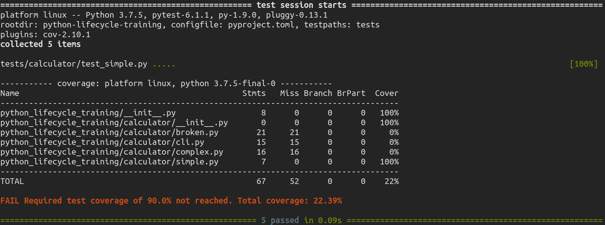
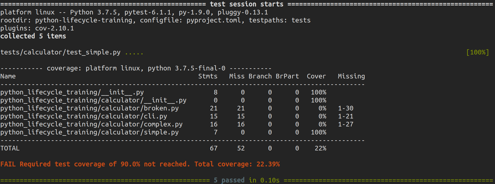
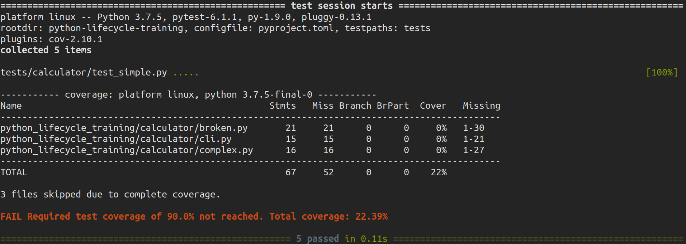
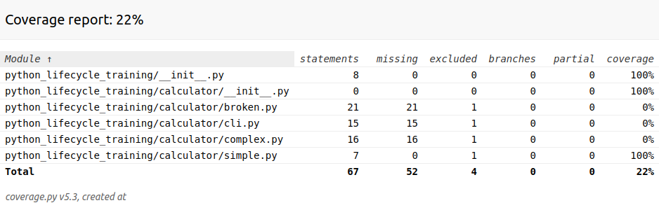

===================
Testing: pytest-cov
===================

**pytest-cov** is a pytest plugin that produces coverage reports. Compared to just using
``coverage run`` this plugin has some extra features:

* Subprocess support: you can fork or run stuff in a subprocess and will get covered
  without any fuss.
* Consistent pytest behavior. If you run ``coverage run -m pytest`` you will have
  slightly different ``sys.path`` (CWD will be in it, unlike when running ``pytest``).

All features offered by the coverage package should work, either through pytest-cov’s
command line options or through coverage’s config file.

Installation
------------

.. code-block:: console

    $ poetry add pytest-cov --dev

Usage
-----

.. code-block:: console

    $ pytest --cov

Terminal report with missing line numbers:

.. code-block:: console

    $ pytest --cov --cov-report=term-missing

Terminal report with skip covered:

.. code-block:: console

    $ pytest --cov --cov-report=term-missing:skip-covered

HTML report:

.. code-block:: console

    $ pytest --cov --cov-report=html
    $ chromium htmlcov/index.html

.. note:: You can replace pytest and coverage with pytest-cov in your dev-dependencies

Pre-commit
----------

We can run tests before every commit by adding the following in
``.pre-commit-config.yaml`` file:

.. code-block:: YAML

    - repo: local
    hooks:
      - id: install-dependencies
        name: Install Dependencies
        entry: poetry install
        language: python
        always_run: true
        pass_filenames: false

      - id: test
        name: Run tests
        entry: poetry run pytest --cov --cov-report=term-missing
        language: python
        always_run: true
        pass_filenames: false
