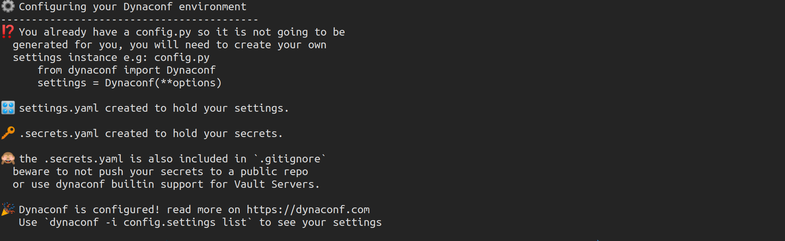
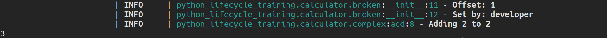
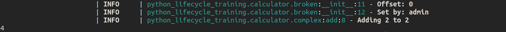
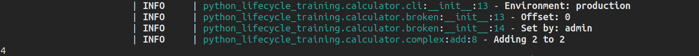

==================================
Configuration Management: dynaconf
==================================

Features
--------

* Inspired by the `12-factor application guide`_
* **Settings management** (default values, validation, parsing, templating)
* Protection of **sensitive information** (passwords/tokens)
* Multiple **file formats** ``toml|yaml|json|ini|py`` and also customizable loaders.
* Full support for **environment variables** to override existing settings (dotenv
  support included).
* Optional layered system for **multi environments** ``[default, development, testing,
  production]`` (also called multi profiles)
* Built-in support for **Hashicorp Vault** and **Redis** as settings and secrets
  storage.
* Built-in extensions for **Django** and **Flask** web frameworks.
* **CLI** for common operations such as ``init, list, write, validate, export``.

For more information visit https://www.dynaconf.com/

Installation
------------

.. code-block:: console

    $ poetry add dynaconf

Initialization
--------------

.. code-block:: console

    $ mkdir configs
    $ dynaconf init -p configs -f yaml

This command creates the following files::

    .
    ├── configs/
    │   ├── .gitignore
    │   ├── .secrets.toml # Sensitive data like passwords and tokens (optional)
    │   └── settings.toml # Application setttings (optional)
    └── config.py         # Where you import your settings object (required)

Fix the paths for your settings files in ``config.py``

.. code-block:: python

    settings_files=["configs/settings.yaml", "configs/.secrets.yaml"]

Basic Usage
-----------

Let us create a broken calculator to see how dynaconf works.

.. code-block:: python

    # python_lifecycle_training/calculator/broken.py
    import fire
    from loguru import logger

    from config import settings
    from python_lifecycle_training.calculator.complex import Calculator

    class BrokenCalculator(Calculator):
        def __init__(self):
            offset = settings.offset
            logger.info(f"Offset: {offset}")
            self.offset = offset

        def add(self, a, b):
            return super(BrokenCalculator, self).add(a, b) - self.offset

        def sub(self, a, b):
            return super(BrokenCalculator, self).sub(a, b) - self.offset

        def mul(self, a, b):
            return super(BrokenCalculator, self).mul(a, b) - self.offset

        def div(self, a, b):
            return super(BrokenCalculator, self).div(a, b) - self.offset

    def main():
        fire.Fire(BrokenCalculator)

Add an offset in ``settings.yaml`` file:

.. code-block:: YAML

    offset: 2

Add an entry point in ``pyproject.toml``

.. code-block:: cfg

    calc-broken = "python_lifecycle_training.calculator.broken:main"

Install your package

.. code-block:: console

    $ poetry install

Run the command

.. code-block:: console

    $ calc-broken add 2 2

.. image:: docs/_static/dynaconf/img/run.png
    :alt: Broken Calculator

Environment Variables
~~~~~~~~~~~~~~~~~~~~~

Dynaconf prioritizes environment variables over files as the best recommendation to keep
your settings. You can override any setting key by exporting an environment variable
prefixed by ``DYNACONF_`` (or by the custom prefix)

.. code-block:: console

    $ export DYNACONF_OFFSET=1
    $ calc-broken add 2 2

.. image:: docs/_static/dynaconf/img/env-offset.png
    :alt: Broken Calculator with offset from environment

.. note:: To unset the variable run ``unset DYNACONF_OFFSET``

You can customize the prefix for your env vars by changing it in ``config.py``

Advanced Features
-----------------

Switch Work Environment
~~~~~~~~~~~~~~~~~~~~~~~

Enable environment switching

.. code-block:: python

    settings = Dynaconf(
        envvar_prefix="DYNACONF",
        settings_files=["configs/settings.yaml", "configs/.secrets.yaml"],
        environments=True,
    )

Edit ``settings.yaml``

.. code-block:: YAML

    default:
      name: ""
      offset: 1

    development:
      name: developer

    production:
      offset: 0
      name: admin

Log the ``name`` of the user running the broken calculator

.. code-block:: python

    def __init__(self):
        offset = settings.offset
        logger.info(f"Offset: {offset}")
        logger.info(f"Set by: {settings.name}")
        self.offset = offset

Run command

.. code-block:: console

    $ calc-broken add 2 2

Dynaconf sets the default environment to ``development``.

The subsequent workspace inherits the configurations of the upper workspace unless
replaced. Thus, we could access the offset in ``development`` even though we didn’t
specify it explicitly.

Switch Environment using Environment Variable
~~~~~~~~~~~~~~~~~~~~~~~~~~~~~~~~~~~~~~~~~~~~~

.. code-block:: console

    $ export ENV_FOR_DYNACONF=production
    $ calc-broken add 2 2

.. note:: Unset `ENV_FOR_DYNACONF` using ``unset ENV_FOR_DYNACONF``

Switch Environment using CLI
~~~~~~~~~~~~~~~~~~~~~~~~~~~~

Set environment to ``development`` in your package ``__init__.py`` file

.. code-block:: python

    ENV = "development"

Update the broken calculator

.. code-block:: python

    import python_lifecycle_training

    class BrokenCalculator(Calculator):
        def __init__(self):
            with settings.using_env(python_lifecycle_training.ENV):
                offset = settings.offset
                logger.info(f"Offset: {offset}")
                logger.info(f"Set by: {settings.name}")
                self.offset = offset

Create a common CLI

.. code-block:: python

    # python_lifecycle_training/calculator/cli.py
    import fire
    from loguru import logger

    import python_lifecycle_training
    from python_lifecycle_training.calculator.broken import BrokenCalculator
    from python_lifecycle_training.calculator.complex import Calculator
    from python_lifecycle_training.calculator.simple import add

    class Main:
        def __init__(self, env: str = "development"):
            self.env = env
            logger.info(f"Environment: {self.env}")
            python_lifecycle_training.ENV = self.env

            self.simp = add
            self.complex = Calculator
            self.broken = BrokenCalculator

    def main():
        fire.Fire(Main)

Update entry point scripts

.. code-block:: cfg

    [tool.poetry.scripts]
    calc = "python_lifecycle_training.calculator.cli:main"

Install package

.. code-block:: console

    $ poetry install

Run command on ``production`` environment from CLI

.. code-block:: console

    calc broken add 2 2 --env=production

.. _12-factor application guide: https://12factor.net/config
