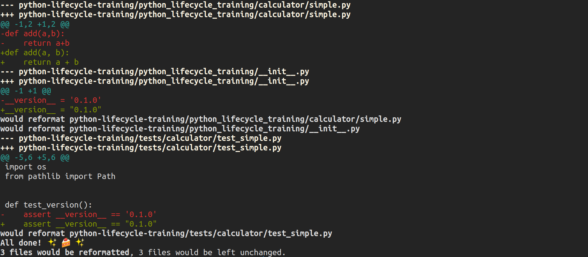

=====
Black
=====

**Black** gives you speed, determinism, and freedom from **pycodestyle** nagging about
formatting. You will save time and mental energy for more important matters.

**Black** makes code review faster by producing the smallest diffs possible. Blackened
code looks the same regardless of the project you’re reading. Formatting becomes
transparent after a while and you can focus on the content instead.

For further information visit https://black.readthedocs.io/en/stable/

Installation
------------

.. code-block:: console

    $ poetry add black --dev

Check
-----

.. code-block:: console

    $ black python_lifecycle_training tests --diff --color

Usage
-----

.. code-block:: console

    $ black python_lifecycle_training tests

.. image:: docs/_static/black/img/usage.png
   :alt: Black output

To move on to the next step commit or stash your changes then checkout to the branch
``init/format/isort``

.. code-block:: console

    $ git stash
    $ git checkout init/format/isort

Uninstall
---------

.. code-block:: console

    $ poetry remove black --dev
