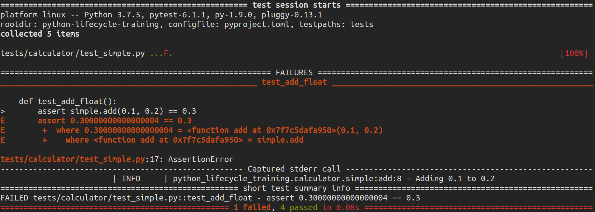

===============
Testing: pytest
===============

The **pytest framework** makes it easy to write small tests, yet scales to support
complex functional testing for applications and libraries.

* Detailed info on failing assert statements (no need to remember self.assert* names)
* Auto-discovery of test modules and functions
* Modular fixtures for managing small or parametrized long-lived test resources
* Can run unittest (including trial) and nose test suites out of the box
* Python 3.5+ and PyPy 3
* Rich plugin architecture, with over 315+ external plugins and thriving community

For more information visit https://docs.pytest.org/en/stable/

Installation
------------

.. code-block:: console

    $ poetry add pytest --dev

Configuration
-------------

Add the following in ``pyproject.toml``:

.. code-block:: cfg

    [tool.pytest.ini_options]
    testpaths = "tests"

Usage
-----

Let's write a test for the simple calculator in ``test_simple.py``

.. code-block:: python

    from python_lifecycle.calculator import simple

    def test_add():
        assert simple.add(1, 2) == 3

.. note:: You can replace the version test and remove the variable ``__version__`` from
   your package init file

To execute pytest run:

.. code-block:: console

    $ pytest

.. image:: docs/_static/pytest/img/simple-add.png
   :alt: Simple addition test

**pytest** will run all files of the form ``test_*.py`` or ``*_test.py`` in the current
directory and its subdirectories. Thus we can write any sort of tests we want.

.. code-block:: python

    from python_lifecycle_training.calculator import simple

    def test_add_positives():
        assert simple.add(1, 2) == 3

    def test_add_negatives():
        assert simple.add(-1, -2) == -3

    def test_add_mixed():
        assert simple.add(1, -2) == -1

    def test_add_float():
        assert simple.add(0.1, 0.2) == 0.3

    def test_add_str():
        assert simple.add("hello ", "world") == "hello world"

Run test:

.. code-block:: console

    $ pytest

Whoops! Something doesn't seem right.

We need to handle `float` values a little differently when writing tests. We just need
to check whether the value obtained is close enough.

.. code-block:: python

    import pytest

    def test_add_float():
        assert simple.add(0.1, 0.2) == pytest.approx(0.3)

Now run the tests again.

.. code-block:: console

    $ pytest

All tests have passed. Congratulations!

There is, however, one more thing to notice here. The tests passed for "hello world" as
well even though we’ve explicitly said that the method add takes nothing but real
numbers. This is because Python computes the types dynamically and type check is just a
convention we use for the ease of code maintenance and future development.

Next Step
---------

To move on to the next step commit or stash your changes then checkout to the branch
``setup/test/coverage``

.. code-block:: console

    $ git stash
    $ git checkout setup/test/coverage

Uninstall
---------

.. code-block:: console

    $ poetry remove pytest --dev
