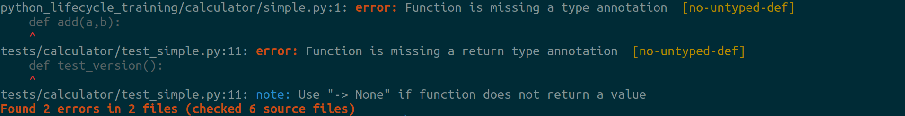

====
MyPy
====

**Mypy** is a static type checker for Python. If you sprinkle your code with type
annotations, mypy can type check your code and find common bugs. As mypy is a static
analyzer or a lint-like tool, the type annotations are just hints for mypy and don’t
interfere when running your program. You run your program with a standard Python
interpreter, and the annotations are treated effectively as comments.

For further information visit https://mypy.readthedocs.io/en/stable/introduction.html

Installation
------------

.. code-block:: console

    $ poetry add mypy --dev

Configuration
-------------

Add the following in ``setup.cfg``:

.. code-block:: cfg

    [mypy]
    ignore_missing_imports = true
    disallow_untyped_defs = true
    warn_redundant_casts = true
    warn_unreachable = true
    show_error_codes = true
    pretty = true

Usage
-----

.. code-block:: console

    $ mypy python_lifecycle_training tests

Resolution
----------

.. code-block:: python

    from numbers import Real

    def add(a: Real, b: Real) -> Real:
        return a + b

.. code-block:: python

    def test_version() -> None:
        assert __version__ == "0.1.0"

Add a badge
-----------

.. image:: http://www.mypy-lang.org/static/mypy_badge.svg
    :target: http://mypy-lang.org/
    :alt: Checked with mypy

.. code-block:: RST

    .. image:: http://www.mypy-lang.org/static/mypy_badge.svg
        :target: http://mypy-lang.org/
        :alt: Checked with mypy

Next Step
---------

To move on to the next step commit or stash your changes then checkout to the branch
``init/pre-commit``

.. code-block:: console

    $ git stash
    $ git checkout init/pre-commit

Uninstall
---------

.. code-block:: console

    $ poetry remove mypy --dev
