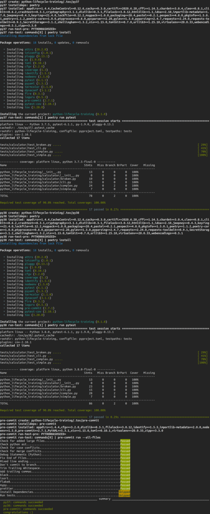

============
Testing: tox
============

**tox** is a generic virtualenv management and test command line tool you can use for:

* checking that your package installs correctly with different Python versions and
  interpreters
* running your tests in each of the environments, configuring your test tool of choice
* acting as a frontend to Continuous Integration servers, greatly reducing boilerplate
  and merging CI and shell-based testing.

**tox** aims to automate and standardize testing in Python. It is part of a larger
vision of easing the packaging, testing and release process of Python software.

For more information visit https://tox.readthedocs.io/en/latest/

Installation
------------

.. code-block:: console

    $ poetry add tox --dev

Configuration
-------------

Put basic information about your project and the test environments you want your project
to run in into a ``tox.ini`` file.

.. code-block:: ini

    [tox]
    envlist = py37, py38, pre-commit
    skipsdist = true

    [testenv]
    deps = poetry
    allowlist_externals = poetry
    commands_pre = poetry install
    commands = poetry run pytest

    [testenv:pre-commit]
    skip_install = true
    deps = pre-commit
    setenv = SKIP=install-dependencies,test
    commands = pre-commit run --all-files

Usage
-----

.. code-block:: console

    $ tox

Next Step
---------

To move on to the next step commit or stash your changes then checkout to the branch
``deploy/docs/sphinx``

.. code-block:: console

    $ git stash
    $ git checkout deploy/docs/sphinx

Uninstall
---------

.. code-block:: console

    $ poetry remove tox --dev
